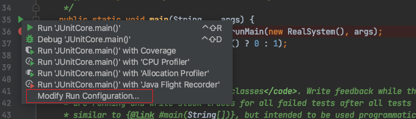
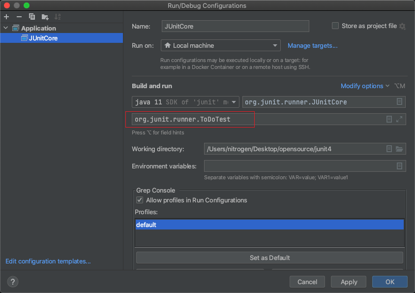

源代码跟踪调试
1. 编写一个org.junit.runner.ToDoTest 类
2. 找到org.junit.runner.JUnitCore的main方法
3. 
4. 
5. debug 开始跟踪源码

# JUnit 4
JUnit is a simple framework to write repeatable tests. It is an instance of the xUnit architecture for unit testing frameworks.

For more information, please visit:
* [Wiki](https://github.com/junit-team/junit4/wiki)
* [Download and Install guide](https://github.com/junit-team/junit4/wiki/Download-and-Install)
* [Getting Started](https://github.com/junit-team/junit4/wiki/Getting-started)

